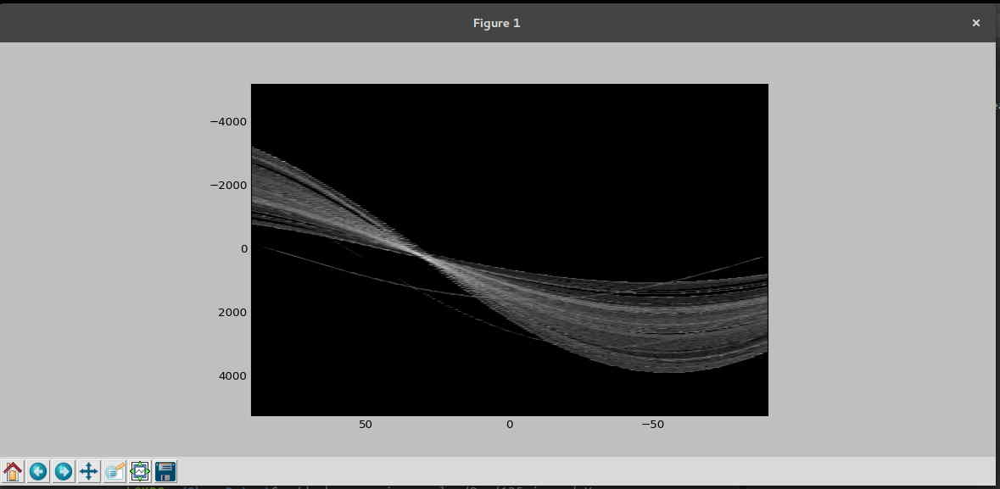

# Alyn

[](https://badge.fury.io/py/alyn)

## Skew detection and correction in images containing text

</img>
<h5>Image with skew</h5>

<h5>Image after deskew</h5>

### Install and use via pip!

Recommended way(using virtualenv):

1. `mkdir alyn-test`
2. `cd alyn test`
3. `mkvirtualenv .`
4. `pip install alyn`
5. `source bin/activate`

#### To detect skew angle in image:

```
from alyn import SkewDetect
sd = SkewDetect(
	input_file='path_to_file',
	batch_path='optional_batch_processing_path',
	output_file='optional_text_file_output_path',
	display_output='Yes/No')
sd.run()
```

##### Extra options:

* `sigma`:canny edge detection blurring
* `plot_hough`: display hough lines detected
* `num_peaks`: control the number of hough line peaks

#### To deskew image:

```
from alyn import Deskew
d = Deskew(
	input_file='path_to_file',
	display_image='preview the image on screen',
	output_file='path_for_deskewed image',
	r_angle='offest_angle_in_degrees_to_control_orientation')`
d.run()
```
### Requires

* `numpy`
* `matplotlib`
* `scipy`
* `scikit-image`

### Techniques used

* Canny Edge Detection
* Hough Transform

### Features

* Detect the skew in given images
* Display the output 
* Save the output to txt file
* Batch process files in a directory
* View Hough Transform of a given image
* Set the number of peaks for Hough Transform and Sigma for Canny Edge detection
* Rotate the image to remove the skew

### How the skew detection works

The skew detection script takes image file as input, then performs the following steps:

* Converts the image to greyscale
* Performs Canny Edge Detection on the Image
* Calculates the Hough Transform values
* Determines the peaks
* Determines the deviation of each peaks from 45 degree angle
* Segregates the detected peaks into bins
* Chooses the probable skew angle using the value in the bins

The deskew script uses the skew angle determined using skew detection script to remove the skew from the image.

### Using scripts directly(older method)

#### Image skew calculation using skew_detect.py

To calculate the skew angle for a given image file, use `-i` option followed by the path to file:

	./skew_detect.py -i image.jpg

To save output in a text file add `-o` option followed by the output file name:
	
	./skew_detect.py -i image.jpg -o output.txt

To display output information add `-d` option followed by a string `Yes`:
	
	./skew_detect.py -i image.jpg -d Yes

To batch process files in a directory, use `-b` option followed by the path to directory:
	
	./skew_detect.py  -b examples

To display Hough Transform plot for an image,:
	
	./skew_detect.py -i image.jpg -p Yes

##### Output of the Hough Transform:

	

To set the value of sigma for Gaussian blurring in Canny Edge Detection,  use `-s` option followed by the desired value:
	
	./skew_detect.py -i image.jpg -s 3

To set the number of peaks collected from Hough Transform, use `-n` option followed by the desired value:

	./skew_detect.py -i image.jpg -n 10

### Image Deskew using deskew.py

To perform a simple deskew and display the output:
	
	./deskew.py -i image.jpg -d Yes

To save the deskewed image, use the following:

	./deskew.py -i image.jpg -o rotated.jpg

In some cases the result image might be upside down or the text may be running vertical, To fix this, use `-r` followed by the desired angle in `int`:
	
	./deskew.py -i image.jpg -o rotated.jpg -r 90

To generate data for experimental purposes, run the test_img_gen.py in test_data folder. This will generate images containing a white line having angle between 0 to 180 degrees.
